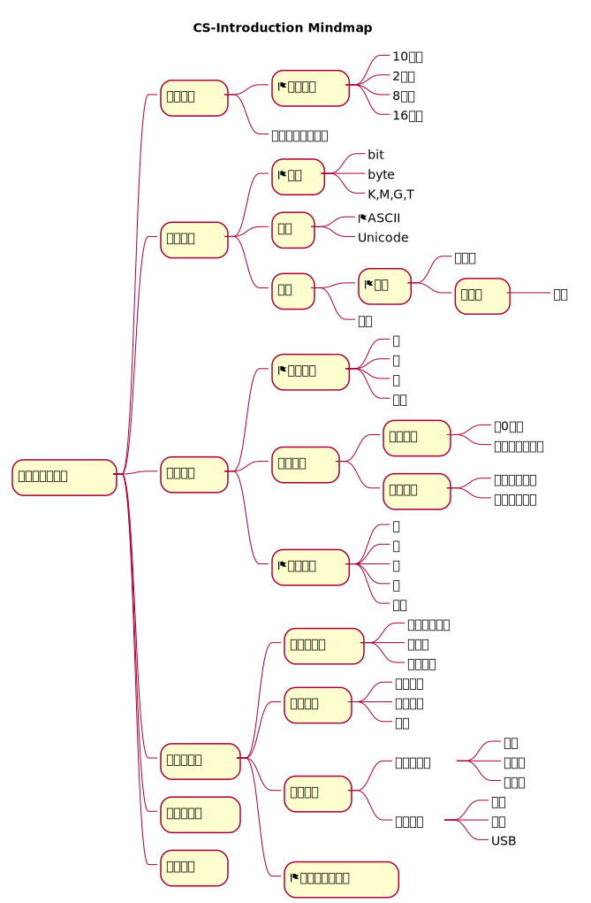

# Table of Contents

1.  [计算机科学导论](#orgb89b9c0)
2.  [课程安排](#org4b636a7)
3.  [学习路线](#orga72e29e)

# 计算机科学导论

# 课程安排

<table border="2" cellspacing="0" cellpadding="6" rules="groups" frame="hsides">

<colgroup>
<col  class="org-left" />

<col  class="org-right" />
</colgroup>
<thead>
<tr>
<th scope="col" class="org-left">课程内容</th>
<th scope="col" class="org-right">学时</th>
</tr>
</thead>

<tbody>
<tr>
<td class="org-left">计算机发展历程</td>
<td class="org-right">0.5</td>
</tr>

<tr>
<td class="org-left">数字系统</td>
<td class="org-right">2</td>
</tr>

<tr>
<td class="org-left">数据存储</td>
<td class="org-right">2</td>
</tr>

<tr>
<td class="org-left">数学运算</td>
<td class="org-right">2</td>
</tr>

<tr>
<td class="org-left">计算机组成</td>
<td class="org-right">2</td>
</tr>

<tr>
<td class="org-left">计算机网络</td>
<td class="org-right">2</td>
</tr>

<tr>
<td class="org-left">操作系统</td>
<td class="org-right">2</td>
</tr>
</tbody>
</table>

# 学习路线

